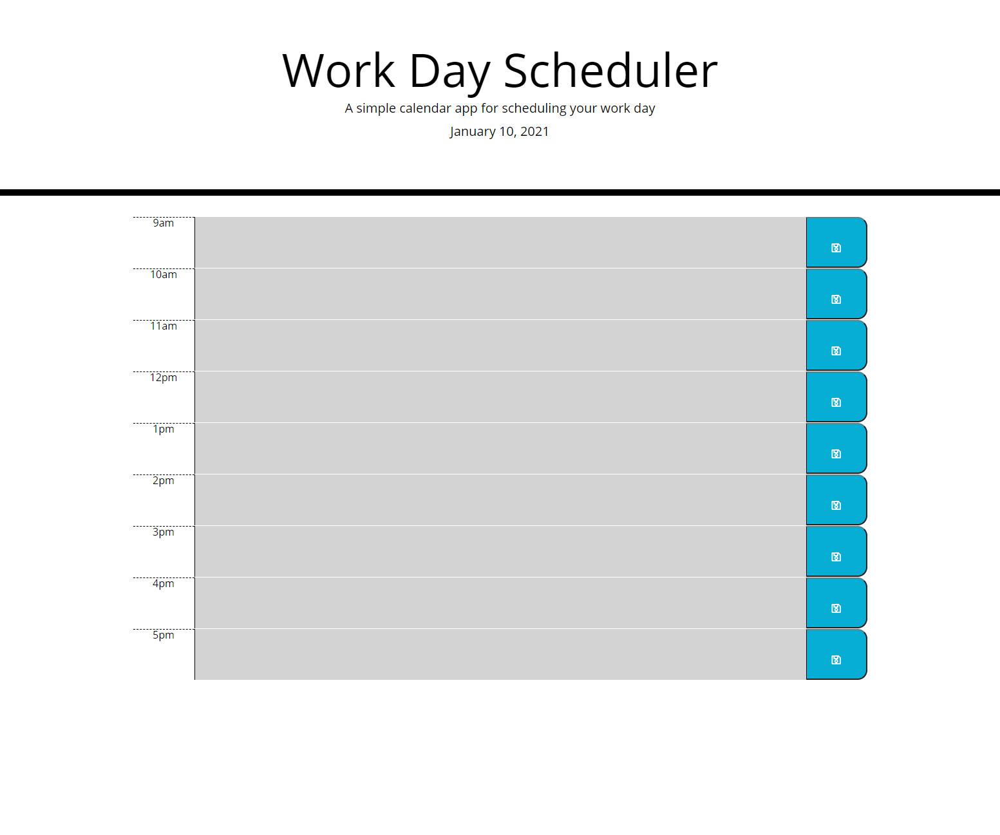

# Scheduler

## The Mission
Utilizing all the information that we have gathered up until this point we have been tasked to put together a weekly scheduler that will allow users to insert any tasks needed to be accomplished during the week.
Using the helpful techniques such as localStorage() we are able to store any information entered in the text field in the local browser memory. 
This task also allowed us to learn the usefulness of third party APIs such as Bootstrap and Moment.js to name a couple. 

### Example of the Website
Below you will see a screenshot of the current site: https://azun510.github.io/Scheduler/

